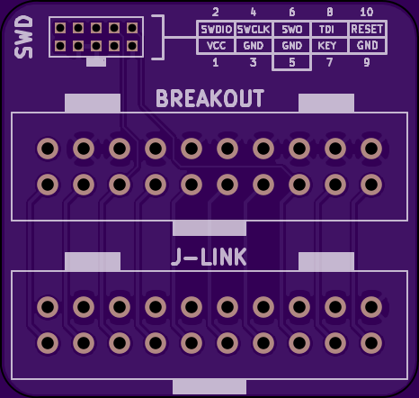
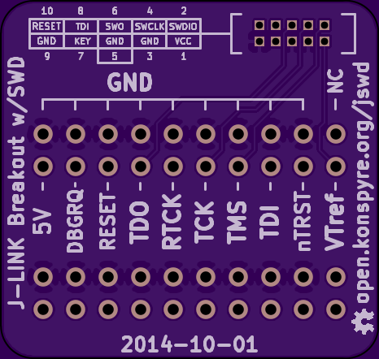
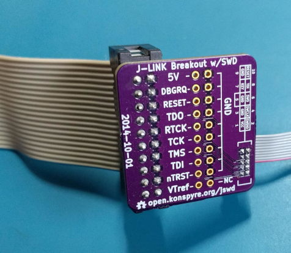

# Segger SWD/JTAG Breakout Board

<a href="https://oshpark.com/shared_projects/w7QyiW3S"></img></a>

A breakout board for the Segger J-Link (2.54mm pitch) to SWD (1.27mm pitch) headers. Includes silkscreen pinouts for both 2.54mm and 1.27mm pitch connections with mirroring on the opposite sides, and a broken out header area for point-to-point connections.

### Parts

| Quantity | Description                           | Digikey Part Number |
| -        | -                                     | -                   |
| 1        | 2.54mm header (Segger to board)       | [D2520-6002-AR](https://www.digikey.com/products/en?keywords=D2520-6002-AR) | 
| 1        | 1.27mm header  (Board to SWD)         | [952-1383-ND](https://www.digikey.com/products/en?keywords=952-1383-ND)     |
